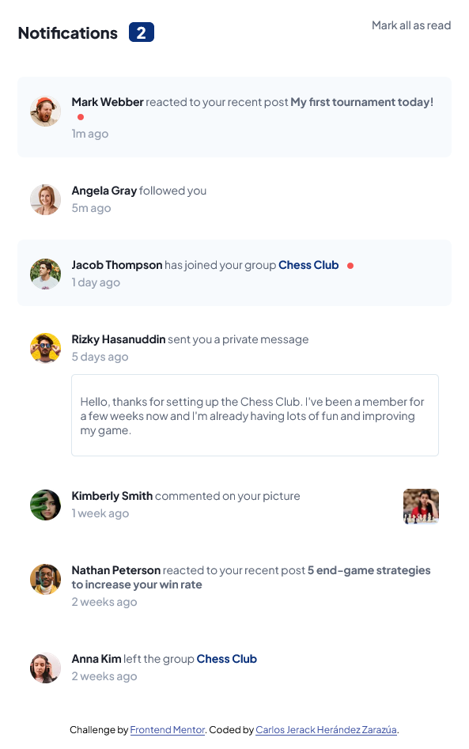

# Frontend Mentor - Notifications page
Esta es mi solucion del reto `Notifications page`, de la plataforma [Frontend Mentor](https://www.frontendmentor.io). Originalmente este proyecto se realizo en en canal de You Yube de [freeCodeCampEspañol](https://www.youtube.com/@freecodecampespanol) en el curso [Aprende Tailwind CSS - Curso Completo](https://youtu.be/5HtRcMSO1Ro?si=D1xbaQ8Imaljl3km).

## Screenshot de mi solución
- Solution URL: [Repositorio en GitHub](https://github.com/Motorbreath-lml/Frontend-Mentor-NotificationsPage)
- Live Site URL: [GitHub pages](https://motorbreath-lml.github.io/Frontend-Mentor-NotificationsPage/)

### Mi proceso
[David Ruiz](https://www.youtube.com/@CodingTube) instructor del curso propone una solución para realizar este reto, partiendo de este codigo realice algunas modificaciones, ya que en las imagenes guia del reto, se observa que las notificaciones una vez leidas, el fondo de estas es blanco, realice el cambio en el proyecto ademas de utilizar medidas REM para que se adapte el proyecto mejor a los diferentes tipos de pantallas.

### Conclusión
Este proyecto es parte de mi aprendizaje, he estado haciendo diferentes cursos en diferentes plataforma como lo es You Yube, Udemy y Platzi, he aprendido sobre el diseño responsivo del proyecto ya que no sabes con exactitud en que dispositivo el usuario consumira el producto, pero lo mas probable es que sea en un Smarthphone o dispositivo movil. Es por eso la importancia de usar buenas practicas de programacion para reutilizar lo mas posible el codigo y si es necesario realizar cambios en el proyecto a futuro.

Note que en el curso se fue resolviendo para que el proyecto se vea lo mas parecido al diseño, desde mi perpectiva se tendria que hacer una notificacion que se pudiera reautilizar constantemente solo cambiando el contenido de esta.

Este es mi primer proyecto usando JavaScript, al momento de realizar estos comentarios aun no aprendo como utilizar de manera optima JavaScript con un Backend, para poder reutilizar el codigo HTML y CSS, pude haber utilizado mas CSS Flex para crear notificaciones mas responsivas, dividir la notificacion en usuarios, notificacion, imagenes, y junto con HTML crear una semantica que se pudiera entender mejor, con el fin de modificar su contenido cuando se utiliza JavaScript, pienso crear una variable para el post y atravez de los metodo del lenguaje ir alterando el contenido de la varibale.

Por el momento el proyecto lo dejare asi, hasta que avance mas en mis cursos y poder crear codigo con mejores practicas de desarrollo.